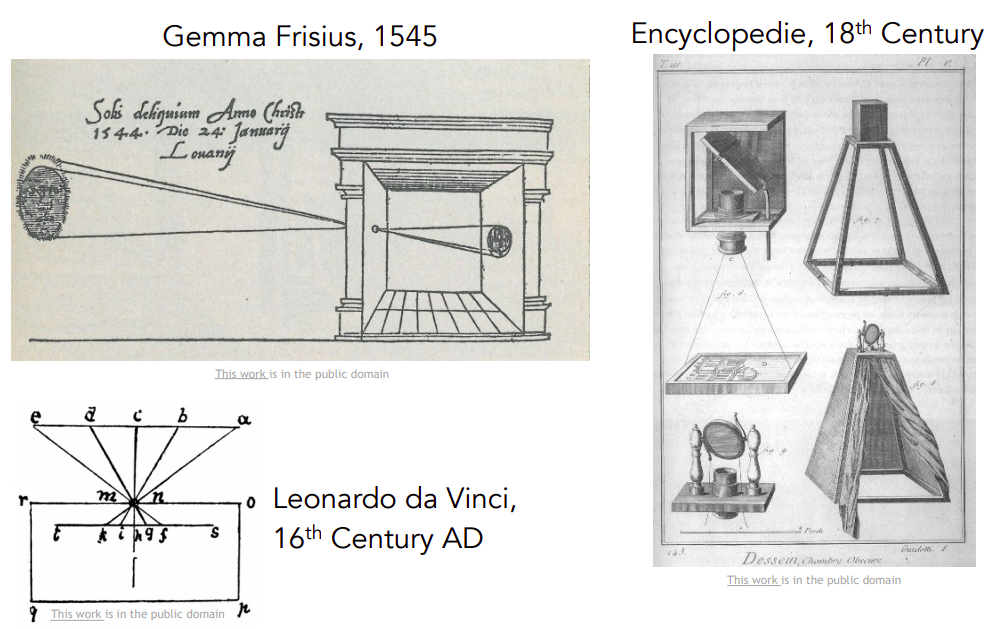

# **Computer Vision**  

Computer vision is the study of visual data, which has exploded in the last couple of years due to the large number of sensors (cameras) in the world. 

A 2015 study from Cisco estimated that by 2017, 80% of all traffic on the internet would be video, and it is critical to develop algorithms that can utilize and understand this data. However, there is a problem with visual data: it is hard to understand. Visual data is often referred to as the "dark matter" of the internet, as it is difficult for algorithms to understand and see all of the visual data on the web. 

This is exemplified by the fact that for every second in real time, approximately five hours of video are uploaded to YouTube. Google has a lot of employees, but they cannot sit down and watch, understand, and annotate every video, so it is important to develop technologies that can dive in and automatically understand the content of visual data. 

Computer vision is an interdisciplinary field that relies on many different areas of science:
- Biology 
- Psychology
- Computer Science
- Mathematics
- Physics
- Engineering

$$ Interdiscinplinarism\ of\ Computer\ Vision$$

# **History of Vision**
## Biological (Evolutionary) background

The evolution of vision can be traced back to 543 million years ago. During this time, life was mostly on the water, and animals didn't move around much. However, something remarkable happened around 540 million years ago when the number of animal species exploded from a few to hundreds of thousands. 
The explosion in number of species happened in a short time-span of 10 million years.This was known as "Evolution's Big Bang" and was a mystery for many years. Andrew Parker proposed one of the most convincing theories from studying the fossils, the reason for explosion of the species was speciation(beginning of vision). The animals began to see and the dynamics of being a prey and predator triggered necessity of faster evolution. 

$$Evolution's\  Big\ Bang$$

Vision has become the biggest sensory system of almost all animals, with almost 50% of the neurons in our cortex involved in visual processing. Vision is extremely important for animals, especially intelligent animals, and enables them to survive, work, move around, manipulate things, communicate, entertain, and do a variety of other things.

## Artificial Vision
The first camera comes from the 1600s, the Renaissance period called Camera Obscura, This was a camera based on pin-hole camera theories. Similar to early eyes developed by animals.

$$ Concept\ of\ Camera\ Obscura$$

### 60s works

Hubel and Wiesel in early 60s, discovered and discussed the processing of visions in primates and mammals, this inspired _Computer vision_. They claimed the visual processing starts from the edges and moves to the center and brain builds the visual information.

The history of  _Computer vision_ also starts in the 60s. _Block world_ by Larry Roberts 1963 was the first thesis of Computer vision, where the visual world was simplified into simple geometric shapes. The goal of this publication was to recognize and reconstruct these shapes. 

$$Block \ World\ Representation$$

#### _The Summer Vision Project_, MIT, 1966: 
The goal of the project can be summed up from the following sentence from the paper. 

>  _The summer vision project is an attempt to use our summer workers effectively in the construction of significant part of the visual system_

The summer project has grown and blossomed into various researches still being continued. We still have not yet solved the fundamental problems of Computer Vision. 

#### Vision, a book by David Marr

In late 70s, David Marr wrote what he thinks vision is and how we should go about computer vision and developing algorithms that can enable computers to recognize the visual world.
According to Marr,  in order to take an image and arrive at a final wholistic 3D representation we must go through processes.  
The first process is called _primal sketches_ where mostly the edges, the bars, the virtual lines, the ends, the curves and the boundaries (similar approach to that of Hubel and Weisel 's work).
After the _primal sketch_ comes the _$2 \frac{1}{2} D$ sketch_ . Here we start to piece together the surfaces, the depth information, the layers or the discontinuities of the visual scene. 
Eventually the 3D model is obtained. 

$$ Stages\ of \ representation$$

### 70s' Works

 People began to ask the question, "How can we move beyond the simple block world and start recognizing or representing real objects?".  In Pao-Alto, two groups from Stanford and SRI proposed , "Generalized Cylinder" (Brooks & Bindford, 1979) and  "Pictorial Structure" (Fischler and Elschlager, 1973). 

The basic idea behind these is that every object is composed of simple geometric primitives. Example: A person can be shaped by cylindrical shapes or parts represented as circle and their distance. 

| Generalized Cylinder | Pictorial Structure |
| :--: | :--: |
|  | |

### 80's Works

In the 80s, David Lowe presented how to reconstruct or recognize the visual world from simple world structure. Example: recognizing razors from lines (straight lines) and edges. 

> __Note__ :  _Up to this point, although courageous attempt were made, the progress was still very slow and object recognition was not clearly achieved. 
> As the dream of object recognition was too far, people proposed __Object Segmentation___.

### Object Segmentation

Object segmentation is the task of taking an image and group the pixels into meaningful areas.  We might not know that the pixel's group is a person, but we can extract out the pixel group from its background. 

#### Normalized Cuts
Image Segmentation using a graph theory algorithm. Proposed by Jitendra Malik and his student Jianbo Shi from Berkeley in 1997. 

$$Normalized\ Cuts$$

#### Face Detection, Viola & Jones
From 1997 to 2000, traditional Machine Learning and statistical methods were in a boom. During that time an algorithm was proposed. Using Adaboost algorithm to do real-time face detection by Paul Viola and Michael Jones in 2001. 

$$ Viola\ Jones\ Algorithm$$

### Problems till the 90s and 2000s
All these algorithms from the 90s till the 2000s were feature based. This has a lot of problems as matching feature from one picture to another, making it difficult to recognize the object. 

### Early  Solutions

#### SIFT Feature
Early solution to "Pattern Matching" was presented in the work by David Lowe, "SIFT" & Object Detection (1999), which says : _To match an entire object to the same object in another image is very difficult because changes will be there due to camera angle, occlusion (obscure or blocked due to another object) , viewpoint, lighting and the intrinsic variation of the object itself, but there are some features that remain diagnostic and invariant to changes. So the task of object recognition begins with identifying such non-changing features and matching those features to a similar object. Making it easier than Pattern matching._

$$ Stop\ Sign\ SIFT\ feature \ mapping$$

#### Spatial Pyramid Matching
Using same idea: "Diagnostic features", another step was made to recognize scenes. The "Spatial Pyramid Matching (Lazebnik, Schmid & Ponce) 2006" says : _there are features in the images that gives us clue as to which type of scene it is, and we can take the features from different part of the image in different resolution and put it on a __feature descriptor__ and use SVM  algorithm.

$$ Spatial\ pyramid\ matching$$

#### Human recognition
As human recognition is a essential for most parts of our life some of the early works done on  human recognition are:
- Histogram of Gradients (Dalal and Triggs, 2005)
- Deformable Part Model (Felzenswalb, McAllester, Ramanan, 2009)

| Histogram of Gradients | Deformable Part Model |
| :--: | ---- |
|  |  |

### Object Recognition Benchmarks
As we move to the early 2000s, we can see a great shift in the quality and the quantity of the images available in the internet. This lead to lot of data being available which helped us create various benchmarks.

#### PASCAL Visual Object Challenge
It is a dataset composed of 20 object classes like: Train, Airplane, Person, House bottle, Cat, etc. It had several to ten thousand images per class. It was used to evaluate the progress and performance detecting the objects in the dataset made by algorithms. We can see the steady progress being made over the years through this benchmarks.

$$ PASCAL\ VOC\ Benchmark \ Scores\ over\ the\ years$$

#### IMAGENET
 Using traditional machine learning started to overfit the training process as the visual data was very complex and generalization could not be done as the dataset was less and overfitting occurred very soon. Group from Stanford and Princeton started questioning ,"are we ready to recognize every object in the world?". So _Imagenet_ was developed in 3 years downloading images and organizing them into classes using _Wordnet_. _Amazon Mechanical Turk_ was used to sort, clean and label each image. This resulted in a dataset with 22 thousand classes and 14 million objects. It was the biggest AI dataset of the time. 
 
 To benchmark this dataset, _IMAGENET: Large Scale Visual Recognition Challenge_ was developed. For this a test set was derived from the complete dataset with 1.4 million objects with 1000 classes. 

$$The\ IMAGENET\ Classification\ Classes$$

$$ IMAGENET \ Result\ Comparision$$

We can also see the progress here as the _Y-axis_ represents error rate. The _X-axis_ represents the year and the best performing model and we can see the error rate decreasing and becoming on-par and less than Human. 
In 2012, introduction of _CNN_ through _AlexNet_ led to a significant drop in the error rate.  

## Convolutional Neural Networks (CNN)

In the year 2010, NEC-UIUC won the Imagenet Competition. It was hierarchical and traditional that used edge detection, feature detection but it had the basic architecture similar to a CNN .
In year 2012, AlexNet (aka Supervision) won the Imagenet classification competition, it was a CNN based architecture. Hereafter, every winner was a Neural Network based architecture.

### History of CNN
Although Alexnet won the Imagenet and popularized CNNs in 2012. The idea of CNNs from early on and existed in the 90s. Jan LeCun and et al. from Bell Labs in 1998 had written a CNN for recognizing hand written digits. 

$$ Simlilarity\ between\ AlexNet\ and\ LeCun's\ CNN$$

**Possible question**: _If CNNs existed in the 90s why are they popular now?_

**Answer**: 

_The answer can be presented in the following points:_
- _Thanks to Moore's Law (transistors in an IC doubles every two years), computation has got a lot faster and better._
- _Advent of GPUs, that is able to perform parallelized computation_
- _Data available: In the 90s labelled data was not available as it is now._

## Beyond Object Detection and Classification

- We can use this techniques and develop better algorithms for perceptual grouping and semantic segmentation. 
- 3D understanding by recreation of real world object
- Activity recognition
- Example: Visual genome which not only detects and recognizes objects but relation between them in form of a graph. 
