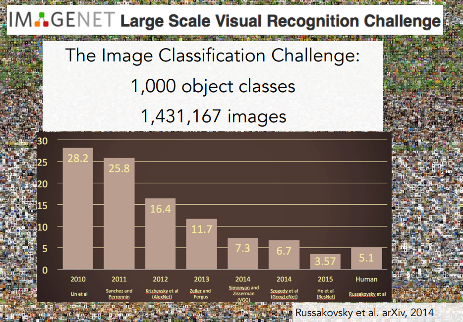

# Introduction to Convolutional Neural Networks for Visual Recognition

### Computer Vision
-  Computer vision is the study of visual data.
- **Importance of Visual Data:**
    - The amount of visual data in the world has significantly increased due to the proliferation of sensors.
    - Smartphones, with their multiple cameras, contribute greatly to this increase.
    - There are likely more cameras in the world than people.
- **Internet Traffic:**
    - A 2015 Cisco study estimated that by 2017, approximately 80% of internet traffic would be video.
    - This statistic highlights the dominance of visual data on the internet.
- **Challenges of Visual Data:**
    - Visual data is often difficult to understand, likened to "dark matter" in physics.
    - Similar to dark matter, visual data comprises a large portion of the internet but is difficult to observe and interpret.
- **YouTube Example:**
    - Approximately 5 hours of video are uploaded to YouTube every second.
    - The sheer volume of video content makes manual analysis and annotation impossible.
    - Automated technologies are necessary to understand and catalog visual data for purposes like serving relevant content and monetization.

---
### Interdisciplinary Fields

- Computer vision is an interdisciplinary field, drawing from various areas of science, engineering, and technology.
- It intersects with:
    - Physics (optics and image formation)
    - Biology and psychology (animal vision and processing)
    - Computer science, mathematics, and engineering (algorithm development and system building)
---
### History of Vision

- **Biological Vision's Origins:**
    - The history of vision traces back approximately 540 million years.
    - At that time, Earth was primarily aquatic, with limited animal species.
    - Early life was passive, with organisms relying on chance encounters with food.
- **The Cambrian Explosion:**
    - Around 540 million years ago, a significant increase in animal species occurred within a relatively short period (10 million years).
    - This phenomenon, known as the Cambrian Explosion, puzzled evolutionary biologists.
    - Andrew Parker, a zoologist, proposed that the development of eyes and the onset of vision triggered this explosion.
- **The Impact of Vision:**
    - Vision enabled animals to become more proactive, with predators hunting prey and prey needing to evade predators.
    - This led to an "evolutionary arms race," driving rapid evolution for survival.
- **Vision's Significance:**
    - Over 540 million years, vision has become the dominant sensory system in most animals, especially intelligent ones.
    - In humans, approximately 50% of cortical neurons are involved in visual processing.
    - Vision plays a crucial role in survival, movement, manipulation, communication, and various other functions.4

- **Camera Obscura:**
    - One of the early known cameras is the camera obscura, originating from the 1600s, during the Renaissance period.
    - It operates on the principles of pinhole camera theory.
    - It shares similarities with early animal eyes, utilizing a hole to collect light and a surface to project the image.
- **Camera Evolution:**
    - Cameras have significantly evolved, becoming ubiquitous sensors in modern technology.
    - They are now found in devices ranging from smartphones to various other types of sensors.

- **Biological Vision Studies:**
    - While camera technology advanced, biologists began researching the mechanisms of vision.
    - The work of Hubel and Wiesel in the 1950s and 1960s was highly influential.
- **Hubel and Wiesel's Research:**
    - They used electrophysiology to study visual processing in mammals, specifically cats.
    - They aimed to understand how the brain processes visual stimuli.
    - They inserted electrodes into the cat's primary visual cortex.
    - They observed how neurons responded to different visual stimuli.
- **Key Findings:**
    - They discovered various types of cells in the primary visual cortex.
    - "Simple cells" were found to respond to oriented edges moving in specific directions.
    - More complex cells also exist.
    - Their research indicated that visual processing begins with simple structures, like oriented edges.
    - As information travels through the visual processing pathway, the brain builds more complex representations of the visual world.

---

### A Block World

- **Early Computer Vision:**
    - The history of computer vision began in the early 1960s.
- **"Block World" Research:**
    - Larry Roberts published "Block World," considered one of the first PhD theses in computer vision.
    - This work simplified the visual world into basic geometric shapes.
    - The goal was to recognize and reconstruct these shapes.

---

### The Summer Vision Project

- **1966 MIT Summer Vision Project:**
    - A notable MIT summer project aimed to construct a significant portion of a visual system.
    - The project's goal was considered highly ambitious, attempting to solve major vision problems within a summer.
- **Evolution of Computer Vision:**
    - Fifty years later, the field of computer vision has expanded significantly.
    - It has grown from a single summer project to a field with thousands of researchers globally.
    - Despite progress, fundamental vision problems remain unsolved.
    - Computer vision has become a crucial and rapidly growing area within artificial intelligence.

---

### Stages of Visual Representation

- **David Marr's Influence:**
    - David Marr, an MIT vision scientist, is recognized for his significant contributions to computer vision.
    - He authored a book in the late 1970s outlining his theories on vision and how to develop computer vision algorithms.
- **Marr's Vision Processing Model:**
    - Marr proposed a hierarchical process for transforming an image into a full 3D representation of the visual world.
    - This process consists of three main stages:
        - **Primal Sketch:**
            - This stage focuses on extracting basic features like edges, lines, curves, and boundaries.
            - It was inspired by the findings of Hubel and Wiesel regarding the early stages of visual processing.
        - **2.5D Sketch:**
            - This stage involves piecing together surfaces, depth information, layers, and discontinuities within the visual scene.
        - **3D Model:**
            - The final stage combines all the information to create a hierarchically organized 3D model with surfaces and volumetric primitives.
- **Impact and Legacy:**
    - Marr's model significantly influenced computer vision research for several decades.
    - His approach provides an intuitive framework for understanding and deconstructing visual information.

---

### Representation

- **Moving Beyond "Block World":**
    - In the 1970s, researchers sought to progress beyond simple geometric shapes and recognize real-world objects.
    - This occurred during a time of limited data and slow computing power.
- **Object Representation Concepts:**
    - Two similar concepts emerged at Stanford and SRI in Palo Alto:
        - **Generalized Cylinders:**
            - This approach represented objects as combinations of simple cylindrical shapes.
        - **Pictorial Structures:**
            - This method represented objects as collections of parts with elastic connections.
    - Both approaches aimed to simplify complex object structures by breaking them down into simpler geometric primitives and their spatial relationships.
- **Impact:**
    - These ideas significantly influenced object recognition research for many years.

- **1980s: Structural Approaches:**
    - David Lowe's work exemplified the trend of reconstructing and recognizing the visual world using simple structures.
    - His research focused on recognizing razors by constructing lines, edges, and their combinations.
- **Challenges of Object Recognition:**
    - Throughout the 1960s, 1970s, and 1980s, researchers grappled with the complex problem of object recognition.
    - Despite ambitious attempts, many solutions remained limited to "toy examples" or small sets of objects.
    - Progress in developing systems that could function in real-world scenarios was slow.
- **Reflection on Vision Problems:**
    - The difficulties encountered led researchers to reconsider the fundamental problems they were trying to solve in computer vision.

---

### Image Segmentation

- **Shift to Image Segmentation:**
    - Recognizing the difficulty of object recognition, researchers began focusing on image segmentation.
    - Image segmentation involves grouping pixels into meaningful regions within an image.
    - The goal is to separate objects from their backgrounds, even without knowing the objects' specific identities.
- **Early Work in Image Segmentation:**
    - Jitendra Malik and his student Jim Borshu from Berkeley conducted seminal work in this area.
    - They utilized graph theory algorithms to tackle the image segmentation problem.

---

### Face Detection

- **Focus on Face Detection:**
    - Face detection became a prominent area of research, recognized as a crucial task for humans.
    - It was an area that made progress ahead of other computer vision problems.
- **Machine Learning's Role:**
    - Around 1999-2000, machine learning techniques, particularly statistical machine learning, gained traction.
    - Techniques like support vector machines (SVMs), boosting, graphical models, and early neural networks were employed.
- **Viola-Jones Face Detection:**
    - Paul Viola and Michael Jones developed a significant contribution using the boosting algorithm for real-time face detection.
    - Their work, published in 2001, achieved near real-time face detection despite the limitations of computer chip speed at the time.
- **Real-World Application:**
    - The Viola-Jones algorithm had a rapid transition from research to practical application.
    - By 2006, Fujifilm released the first digital camera with a built-in real-time face detector.
    - This shows the fast transfer of research to comercial products.

---

### Feature Based Object Recognition

- **Feature-Based Object Recognition:**
    - In the late 1990s and early 2000s, feature-based object recognition became a dominant approach.
    - The SIFT (Scale-Invariant Feature Transform) algorithm, developed by David Lowe, was a seminal work in this area.
    - The core idea was to identify and match invariant features within objects, rather than attempting to match entire objects.
    - This approach addressed challenges related to variations in camera angles, occlusion, viewpoint, lighting, and object variations.
    - SIFT identifies key features and matches them between images.

- **Holistic Scene Recognition:**
    - Researchers began exploring holistic scene recognition, aiming to classify entire scenes.
    - Spatial pyramid matching was an algorithm that used features from different parts of an image at varying resolutions to classify scenes (e.g., landscapes, kitchens, highways).
    - SVM's were then used to classify the features.

- **Human Recognition:**
    - Similar feature-based approaches were applied to human recognition.
    - Algorithms like histogram of oriented gradients (HOG) and deformable body part models were developed to represent and recognize human bodies in images.
- **Impact of Data Availability:**
    - A significant change occurred with the growth of the internet and digital cameras.
    - The quality and quantity of available image data increased dramatically, providing researchers with better resources for studying computer vision.

---

### Visual Object Recognition

- **Object Recognition as a Core Problem:**
    - By the early 2000s, object recognition was established as a critical problem within computer vision.
- **Benchmark Datasets:**
    - The creation of benchmark datasets allowed for the objective measurement of progress in object recognition.
    - The Pascal Visual Object Classes (VOC) challenge became a highly influential benchmark.
        - It contained 20 object classes (e.g., train, airplane, person, cows, bottles, cats).
        - The dataset consisted of thousands of images per category.
    - Researchers developed algorithms and tested them against the dataset's testing set.
- **Progress Measurement:**
    - The Pascal VOC challenge enabled researchers to track their progress over time.
    - Performance on object detection within the dataset steadily improved from 2007 to 2012.
    - This demonstrated significant progress in object recognition capabilities.

---

### Imagenet

- **Motivation for ImageNet:**
    - Researchers aimed to recognize a broader range of objects in the world.
    - They sought to address the machine learning problem of overfitting, which was particularly prevalent with complex visual data.
    - High-dimensional input and complex models required vast amounts of training data to prevent overfitting.
- **ImageNet Project:**
    - The ImageNet project was initiated to create the largest possible dataset of object images.
    - It involved:
        - Downloading billions of images from the internet.
        - Organizing images based on WordNet, a lexical database with tens of thousands of object classes.
        - Utilizing Amazon Mechanical Turk for crowd-sourced labeling and cleaning of the images.
    - The resulting ImageNet dataset contained approximately 15 million images across 22,000 object categories.
    - This was at the time the largest AI dataset.

- **ImageNet Large-Scale Visual Recognition Challenge (ILSVRC):**
    - Starting in 2009, the ImageNet team launched the ILSVRC, an international competition.
    - The challenge used a stringent test set of 1.4 million images across 1,000 object classes.
    - The goal was to evaluate image classification algorithms.
    - Top 5 error was used as the success metric (meaning the algorithm had to have the correct label within its top 5 guesses).

---

### Imagenet Results

- **ImageNet Challenge Results:**
    - The lecture presents a graph showing the error rate of image classification from 2010 to 2015.
    - The error rate steadily decreased over these years.
    - By 2012, the error rate reached a level comparable to human performance.
    - The human performance comparison was done by a Stanford PhD student, to try and replicate human error.
- **Significance of 2012:**
    - A dramatic drop in error rate occurred in 2012, from around 25% to 16%.
    - This significant improvement was achieved by a convolutional neural network (CNN) model.
    - This marked a turning point in the field of computer vision.
- **Convolutional Neural Networks (CNNs) / Deep Learning:**
    - CNNs, also known as deep learning models, became the focus of the course.
    - The course aims to provide a deep understanding of CNNs, including their principles, best practices, and recent advancements.
    - CNNs showed a tremendous capacity and ability to make progress in computer vision, and related fields.
- **Historical Impact:**
    - The 2012 ImageNet challenge demonstrated the power of CNNs in computer vision.
    - This lead to the rise of deep learning.

# Test your Knowledge

**Multiple Choice Questions (MCQs):**

1. **What is the primary focus of Computer Vision?**
    
    - a) Studying human psychology
    - b) Analyzing and understanding visual data (✔️)
    - c) Developing new camera technologies
    - d) Creating 3D models of the world
2. **Approximately how much of internet traffic was estimated to be video by 2017?**
    
    - a) 20%
    - b) 50%
    - c) 80% (✔️)
    - d) 95%
3. **What was a significant event that occurred approximately 540 million years ago?**
    
    - a) The extinction of dinosaurs
    - b) The development of the first cameras
    - c) The Cambrian Explosion and the development of eyes (✔️)
    - d) The beginning of human civilization
4. **Who were Hubel and Wiesel, and what was their primary contribution to understanding vision?**
    
    - a) They invented the camera obscura.
    - b) They developed the SIFT algorithm.
    - c) They studied the neural mechanisms of visual processing in the brain. (✔️)
    - d) They created the ImageNet dataset.
5. **What was the "Block World" project?**
    
    - a) A study of 3D reconstruction using simple geometric shapes. (✔️)
    - b) A project to develop real-time face detection.
    - c) A project to create a large dataset of images.
    - d) A project to study animal vision.
6. **Who proposed a hierarchical model of visual processing with stages like "primal sketch" and "2.5D sketch"?**
    
    - a) David Lowe
    - b) Andrew Parker
    - c) David Marr (✔️)
    - d) Paul Viola
7. **What was the primary goal of the ImageNet project?**
    
    - a) To develop a new type of camera.
    - b) To create a large-scale dataset for object recognition. (✔️)
    - c) To study the evolution of animal vision.
    - d) To develop real-time face detection algorithms.
8. **In what year did convolutional neural networks (CNNs) significantly outperform other algorithms in the ImageNet challenge?**
    
    - a) 2010
    - b) 2011
    - c) 2012 (✔️)
    - d) 2015
9. **What is the Viola-Jones algorithm known for?**
    
    - a) Image Segmentation.
    - b) Feature based object recognition.
    - c) Real time face detection. (✔️)
    - d) Scene recognition.
10. **What was the Pascal VOC challenge?**
    
    - a) A challenge to create the largest image dataset.
    - b) A challenge to improve image segmentation.
    - c) A benchmark dataset for object recognition. (✔️)
    - d) A challenge to create better camera lenses.

---

**Assignment:**

Create a timeline of the major milestones in the history of computer vision, from the Cambrian Explosion to the 2012 ImageNet challenge. Include key figures, projects, and breakthroughs.

**Timeline of Major Milestones in Computer Vision:**

* **~540 Million Years Ago: The Cambrian Explosion:**
    * **Event:** The rapid diversification of animal life, triggered by the development of eyes and the onset of vision.
    * **Significance:** Marks the beginning of biological vision and its evolutionary importance.
    * **Key Figure:** Andrew Parker (proposed the theory).

* **1600s: Camera Obscura:**
    * **Event:** Development of the camera obscura, based on pinhole camera principles.
    * **Significance:** Early step in the development of mechanical vision.
    * **Significance:** Shares similarities to early animal eyes.

* **1950s-1960s: Hubel and Wiesel's Neurophysiological Studies:**
    * **Event:** Research on the neural mechanisms of visual processing in the cat's brain.
    * **Significance:** Identified simple cells and complex cells, revealing how the brain processes edges and builds complex representations.
    * **Key Figures:** David Hubel and Torsten Wiesel.

* **Early 1960s: "Block World" by Larry Roberts:**
    * **Event:** Larry Roberts' PhD thesis, simplifying the visual world into geometric shapes.
    * **Significance:** One of the earliest computer vision projects, focusing on object recognition and 3D reconstruction.
    * **Key Figure:** Larry Roberts.

* **1966: MIT Summer Vision Project:**
    * **Event:** An ambitious project aiming to construct a significant portion of a visual system in one summer.
    * **Significance:** Highlighted the early challenges and long-term goals of computer vision.

* **Late 1970s: David Marr's Vision Theory:**
    * **Event:** Publication of David Marr's book, outlining a hierarchical model of visual processing (primal sketch, 2.5D sketch, 3D model).
    * **Significance:** Provided a framework for understanding and developing computer vision algorithms.
    * **Key Figure:** David Marr.

* **1970s: Generalized Cylinders and Pictorial Structures:**
    * **Event:** Development of object representation methods using geometric primitives.
    * **Significance:** Aimed to recognize real-world objects beyond simple shapes.
    * **Significance:** Two similar ideas from Stanford and SRI.

* **1980s: David Lowe's Structural Approaches:**
    * **Event:** Research focusing on object recognition through the construction of lines and edges.
    * **Significance:** Continued the trend of using simple structures for visual analysis.
    * **Key figure:** David Lowe.

* **Late 1990's early 2000's: Feature Based object recognition and SIFT:**
    * **Event:** Development of SIFT (Scale-Invariant Feature Transform).
    * **Significance:** Allowed for the matching of features between images, even with changes in scale, rotation, and lighting.
    * **Key figure:** David Lowe.

* **Late 1990s-Early 2000s: Machine Learning Techniques and Face Detection:**
    * **Event:** Application of machine learning techniques (SVMs, boosting) to face detection.
    * **Significance:** Achieved real-time face detection, demonstrating the power of machine learning in computer vision.
    * **Key Figures:** Paul Viola and Michael Jones (Viola-Jones algorithm).

* **Early 2000s: Pascal Visual Object Classes (VOC) Challenge:**
    * **Event:** Creation of a benchmark dataset for object recognition.
    * **Significance:** Enabled objective measurement of progress in object recognition.

* **Mid 2000's: Image Segmentation:**
    * **Event:** Reseachers began to focus on image segmentation.
    * **Significance:** Allowed for the grouping of pixels into meaningful areas.
    * **Key figures:** Jitendra Malik and Jim Borshu.

* **2009-2012: ImageNet Large-Scale Visual Recognition Challenge (ILSVRC):**
    * **Event:** Launch of the ILSVRC, a large-scale image classification challenge.
    * **Significance:** Provided a massive dataset and benchmark for object recognition.
    * **Significance:** Lead to the break through of CNN's.
    * **Key figure:** Fei-Fei Li (among others).

* **2012: Convolutional Neural Networks (CNNs) Dominate ImageNet:**
    * **Event:** CNNs achieve a significant breakthrough in image classification accuracy.
    * **Significance:** Marked the rise of deep learning in computer vision.
    * **Significance:** Showed that deep learning could achieve human level accuracy in some vision tasks.

---

Compare and contrast the different approaches to object recognition discussed in the lecture, such as "Block World," feature-based recognition (SIFT), and CNNs. Discuss the strengths and weaknesses of each approach.

**1. "Block World" (Early 1960s):**

- **Approach:**
    - Simplified the visual world into basic geometric shapes (blocks, cylinders, etc.).
    - Focused on recognizing and reconstructing these shapes to understand the scene.
- **Strengths:**
    - Provided a foundational approach to 3D reconstruction and object recognition.
    - Simplified the problem to make it computationally tractable with limited resources.
    - Pioneered the idea of representing objects with simpler primitives.
- **Weaknesses:**
    - Highly limited in its ability to handle real-world objects, which are far more complex than simple geometric shapes.
    - Relied on strong assumptions about the simplicity of the scene.
    - Not robust to variations in lighting, texture, or occlusion.

**2. Feature-Based Recognition (SIFT - Late 1990s/Early 2000s):**

- **Approach:**
    - Identified and extracted distinctive local features (keypoints) in an image.
    - Matched these features between images to recognize objects, even with variations in scale, rotation, and viewpoint.
    - SIFT (Scale-Invariant Feature Transform) was a prominent example.
- **Strengths:**
    - More robust to variations in viewpoint, scale, and lighting compared to "Block World."
    - Focused on invariant features, making it more adaptable to real-world conditions.
    - Effective for object matching and recognition in various applications.
- **Weaknesses:**
    - Relied on handcrafted features, which may not capture all relevant information.
    - Can be computationally expensive, especially for large images.
    - May struggle with highly deformable objects or objects with significant occlusion.
    - Does not learn features, the features are engineered.

**3. Convolutional Neural Networks (CNNs - Post 2012):**

- **Approach:**
    - Uses deep neural networks with convolutional layers to learn hierarchical representations of visual data.
    - Automatically learns features from raw pixel data, eliminating the need for handcrafted features.
    - Achieves state-of-the-art performance in various computer vision tasks, including object recognition.
- **Strengths:**
    - Automatically learns complex and hierarchical features, leading to superior performance.
    - Highly adaptable to various object categories and visual variations.
    - Can handle large datasets and learn from massive amounts of labeled data.
    - Very robust.
- **Weaknesses:**
    - Requires large amounts of labeled training data.
    - Can be computationally intensive, requiring powerful GPUs.
    - "Black box" nature, making it difficult to understand the learned representations.
    - Can be prone to adversarial attacks.

**Comparison Summary:**

- "Block World" was a foundational approach that simplified the problem but was limited to simple geometric shapes.
- Feature-based methods like SIFT improved robustness by focusing on invariant features but still relied on handcrafted features.
- CNNs revolutionized object recognition by automatically learning hierarchical features from data, achieving significantly higher accuracy and adaptability.

---

Choose one of the seminal papers mentioned in the lecture (e.g., Viola-Jones, David Marr's work, SIFT) and write a brief summary of its key contributions and impact on the field.

**Paper: "Rapid Object Detection using a Boosted Cascade of Simple Features" by Paul Viola and Michael Jones (2001)**

**Summary:**

The Viola-Jones algorithm, introduced in this seminal paper, revolutionized real-time object detection, particularly for face detection. The core innovation lies in its ability to achieve high detection rates while maintaining extremely fast processing speeds, even on relatively low-powered hardware. The algorithm's key contributions can be broken down into three main components:

1. **Integral Image:**
    - To drastically reduce the computational cost of feature evaluation, the authors introduced the integral image. This representation allows for the rapid calculation of rectangular features (Haar-like features) at any scale or location within an image.
2. **Haar-like Features:**
    - Instead of using pixel intensities directly, the algorithm employs Haar-like features, which are simple rectangular features that capture differences in image intensity. These features are efficient to compute using the integral image.
3. **AdaBoost and Cascade Structure:**
    - AdaBoost is used to select a small number of critical features from a large pool of Haar-like features, creating a strong classifier.
    - A cascade structure is implemented to further accelerate the detection process. The cascade consists of a series of classifiers, arranged in increasing complexity. Simple classifiers are applied first, and if an image region is rejected by a simple classifier, it is immediately discarded, avoiding the need for more complex and computationally expensive classifiers.

**Key Contributions and Impact:**

- **Real-Time Performance:**
    - The algorithm's speed was a major breakthrough, enabling real-time face detection on standard computer hardware. This opened up a wide range of applications, from digital cameras to video surveillance.
- **Boosted Cascade:**
    - The cascade structure proved to be highly effective in reducing computational cost, making it feasible to process large volumes of image data.
- **Practical Applicability:**
    - The algorithm's simplicity and efficiency made it readily adaptable to various object detection tasks beyond face detection.
- **Influence on Subsequent Research:**
    - The Viola-Jones algorithm became a foundational technique in computer vision, inspiring numerous subsequent research efforts in object detection.
- **Commercial Adoption:**
    - The algorithm was quickly adopted by industry, with companies like Fujifilm incorporating it into digital cameras for automatic face detection. This rapid transition from research to commercial application highlights the algorithm's practical impact.

In essence, the Viola-Jones algorithm provided a practical and efficient solution to real-time object detection, paving the way for numerous applications and influencing the direction of future research in computer vision.

---

Write an essay discussing the impact of the ImageNet dataset and challenge on the development of deep learning and computer vision. Consider the role of large datasets in advancing machine learning.

**The Seismic Shift: ImageNet's Profound Impact on Deep Learning and Computer Vision**

The ImageNet dataset and its associated Large-Scale Visual Recognition Challenge (ILSVRC) stand as a watershed moment in the history of artificial intelligence, particularly in the fields of deep learning and computer vision. Their impact extends far beyond a mere collection of images; they catalyzed a paradigm shift, propelling machine learning into an era of unprecedented progress.

Prior to ImageNet, computer vision research was often constrained by limited datasets and handcrafted features. While algorithms like SIFT and the Viola-Jones detector achieved notable successes, they struggled to generalize to the vast complexity and variability of real-world visual data. Researchers recognized the fundamental limitation: without sufficient data, machine learning models, especially those with high capacity, were prone to overfitting, hindering their ability to learn robust and generalizable representations.

ImageNet addressed this critical bottleneck. Spearheaded by Fei-Fei Li and her team, the project amassed a massive dataset of over 14 million labeled images, encompassing thousands of object categories. This sheer scale provided the essential fuel for training deep neural networks, which inherently require vast amounts of data to learn intricate patterns. The ILSVRC, with its standardized evaluation protocol, provided a competitive platform for researchers to benchmark their algorithms, fostering rapid innovation.

The year 2012 marked a pivotal turning point. Alex Krizhevsky, Ilya Sutskever, and Geoffrey Hinton's "AlexNet," a deep convolutional neural network, shattered previous performance records in the ILSVRC, achieving a significantly lower error rate than its competitors. This breakthrough demonstrated the immense potential of deep learning for visual recognition and ignited a surge of research activity.

The impact of ImageNet can be attributed to several key factors:

- **Data-Driven Learning:**
    - ImageNet demonstrated the power of data-driven learning. The availability of a massive labeled dataset enabled deep neural networks to automatically learn hierarchical features, surpassing the performance of handcrafted features.
- **Standardized Benchmarking:**
    - The ILSVRC provided a standardized platform for evaluating and comparing algorithms, accelerating progress through healthy competition.
- **Catalyzing Deep Learning:**
    - The success of AlexNet in 2012 galvanized the deep learning community, leading to the development of more sophisticated architectures and training techniques.
- **Enabling Real-World Applications:**
    - The advancements fueled by ImageNet have enabled a wide range of real-world applications, from image search and object recognition to autonomous driving and medical imaging.

The role of large datasets in advancing machine learning cannot be overstated. ImageNet exemplified the principle that "data is the new oil." In the context of deep learning, large datasets are not merely a convenience; they are a necessity. They enable models to learn complex relationships and generalize to unseen data, unlocking the full potential of these powerful techniques.

However, the legacy of ImageNet also raises important considerations. Concerns about dataset bias, ethical implications, and the need for more efficient learning methods have emerged. The future of machine learning will likely involve a focus on developing datasets that are more diverse, representative, and ethically sourced, as well as exploring techniques that can learn effectively with smaller amounts of labeled data.

In conclusion, ImageNet's impact on deep learning and computer vision is undeniable. It transformed the landscape of these fields, driving unprecedented progress and paving the way for countless applications that have reshaped our world. The lessons learned from ImageNet will continue to guide the development of machine learning for years to come, emphasizing the crucial role of large datasets in realizing the full potential of artificial intelligence.

---

Why was the year 2012 a turning point in computer vision? What technology made the major break through possible?

The year 2012 was a pivotal turning point in computer vision primarily due to the **ImageNet Large-Scale Visual Recognition Challenge (ILSVRC)**, where a convolutional neural network (CNN) architecture, known as **AlexNet**, achieved a groundbreaking victory.

Here's a breakdown of why it was a turning point and what technology made it possible:

**Why 2012 was a Turning Point:**

- **Significant Performance Jump:**
    - AlexNet dramatically outperformed all previous algorithms in the ILSVRC, achieving a significantly lower error rate. This was a clear demonstration of the superiority of deep learning approaches over traditional methods.
- **Proof of Deep Learning's Potential:**
    - The success of AlexNet provided concrete evidence that deep learning, particularly CNNs, could effectively tackle complex computer vision tasks.
- **Catalyst for Research:**
    - This breakthrough ignited a surge of research and investment in deep learning for computer vision, leading to rapid advancements in the field.
- **Shift from Handcrafted Features:**
    - The victory marked a clear shift from relying on handcrafted features to learned features, proving that machines could automatically extract meaningful visual representations from raw pixel data.

**Technology That Made the Breakthrough Possible:**

- **Convolutional Neural Networks (CNNs):**
    - CNNs are specifically designed to process visual data, using convolutional layers to learn hierarchical features. AlexNet's architecture, with its multiple convolutional layers, was crucial to its success.
- **Availability of Large Datasets (ImageNet):**
    - The ImageNet dataset, with its millions of labeled images, provided the necessary training data for deep neural networks. Deep learning models require vast amounts of data to learn effectively.
- **Increased Computing Power (GPUs):**
    - Training deep neural networks requires significant computational resources. The availability of powerful GPUs (Graphics Processing Units) enabled researchers to train large models like AlexNet in a reasonable amount of time.
- **Advancements in Training Techniques:**
    - Techniques like ReLU activation functions, dropout regularization, and data augmentation played a vital role in improving the training and performance of deep neural networks. These techniques helped to mitigate common problems like vanishing gradients and overfitting.
- **AlexNet Architecture:**
    - The specific architecture of AlexNet itself made a difference. It was a deeper network than previous ones, and it was structured in a way that took advantage of the available GPU processing.10

In essence, the convergence of CNNs, large datasets, and powerful computing resources in 2012 created the perfect storm for a revolution in computer vision.

